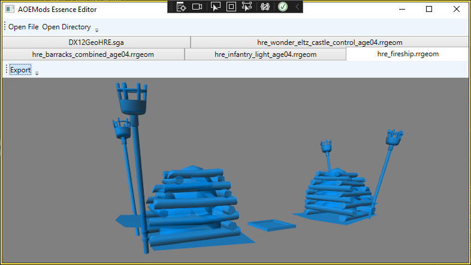

# AOEMods.Essence

C# library and tools for working with Age of Empire 4's Essence engine.

Join the AOE4 modding discord for information sharing, discussions or if you need help: https://discord.gg/h8FX9Uq3vG

## Download
See [Releases page](https://github.com/aoemods/AOEMods.Essence/releases) for downloads.

## Screenshots
**Load an sga archive, convert/export an rrtex file within it**

## Usage
A number of Age of Empires 4 / Essence formats are supported right now and more are being worked on.

### Supported formats
- sga: Read, Convert (unpack into directory), Write
- rrtex: Read, Convert (most common image formats)
- rrgeom: Read (vertex positions, normals, metal, texture coordinates and faces), Convert (obj, gltf/glb)
- rgd: Read, Convert (xml, json), Write (xml)
- Other chunky (most other files contained in .sga archives such as .rrmaterial): Read (editor has hex view)

### Editor
The editor can open sga archives, folders that act as sga archives and individual files.
After opening an archive or folder, files can be mass-exported and mass-converted. The archive
can also be edited, for example adding / renaming / removing files, and saved as an sga file again.

**Note on exporting models**: the editor can export models as gltf files including their materials.
The archives containing the material and textures has to be already open in a tab in the editor
so the editor can find them.

### CLI
The CLI has multiple commands. You can get the full description and list of parameters by running them without any parameters or by passing `--help`.
- `rrtex-decode <input-path> <output-path>`: Converts a `.rrtex` file to an image (supported extensions are `.png, .jpg, .bmp, .tga, .gif`), pass `-b` to treat paths as folders and convert all files
- `rrgeom-decode <input-path> <output-path>`: Converts a `.rrgeom` file to `.obj`, pass `-b` to treat paths as folders and convert all files
- `rgd-encode <input-path> <output-path>`: Converts a `.xml file` to a `.rgd` file, pass `-b` to treat paths as folders and convert all files
- `rgd-decode <input-path> <output-path>`: Converts a `.rgd` file to `.xml` (or `.json` when passing `-f json`), pass `-b` to treat paths as folders and convert all files
- `sga-pack <input-path> <output-path> <archive-name>`: Packs the input directory into a `.sga` archive
- `sga-unpack <input-path> <output-path>`: Unpacks a `.sga` archive into a folder

### Library
The solution contains the library, command line interface and a graphical editor.

**Projects**
- AOEMods.Essence: Library for working with AOE4's files
- AOEMods.Essence.CLI: Command line interface for working with AOE4's files
- AOEMods.Essence.Editor: Graphical user interface for working with AOE4's files
- AOEMods.Essence.Test: Tests for AOEMods.Essence
- AOEMods.Essence.CLI.Test: Tests for AOEMods.Essence.CLI

The library `AOEMods.Essence` consists of two main parts, one for processing the Relic Chunky format and another for processing SGA archives.

**AOEMods.Essence.Chunky**
- `AOEMods.Essence.Chunky.Core` contains classes for processing chunky files in general
- `AOEMods.Essence.Chunky.Graph` is a node graph making use of `AOEMods.Essence.Chunky.Core`
- `AOEMods.Essence.Chunky.*` uses the core and node graph functionality for processing different chunky formats.
- `AOEMods.Essence.FormatReader/Writer` unify the different format readers / writers in one reader / writer.
- `AOEMods.Essence.GltfUtil/ObjUtil` provide functions for converting models to GLTF (`.glb`) and Wavefront object (`.obj`)

**AOEMods.Essence.SGA**
- `AOEMods.Essence.SGA.Core` contains classes for processing SGA archives
- `AOEMods.Essence.SGA.Graph` is a node graph making use of `AOEMods.Essence.SGA.Core`

